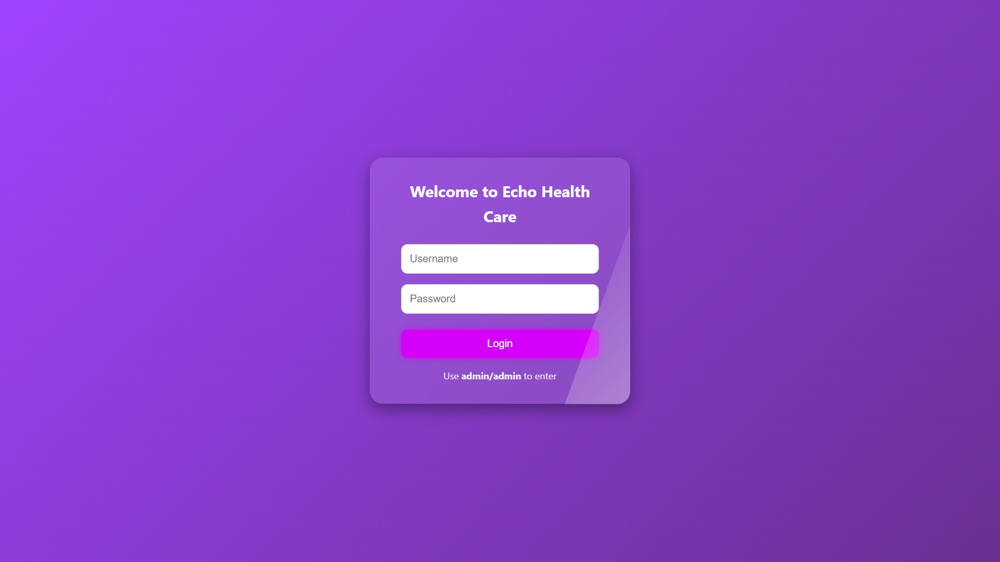
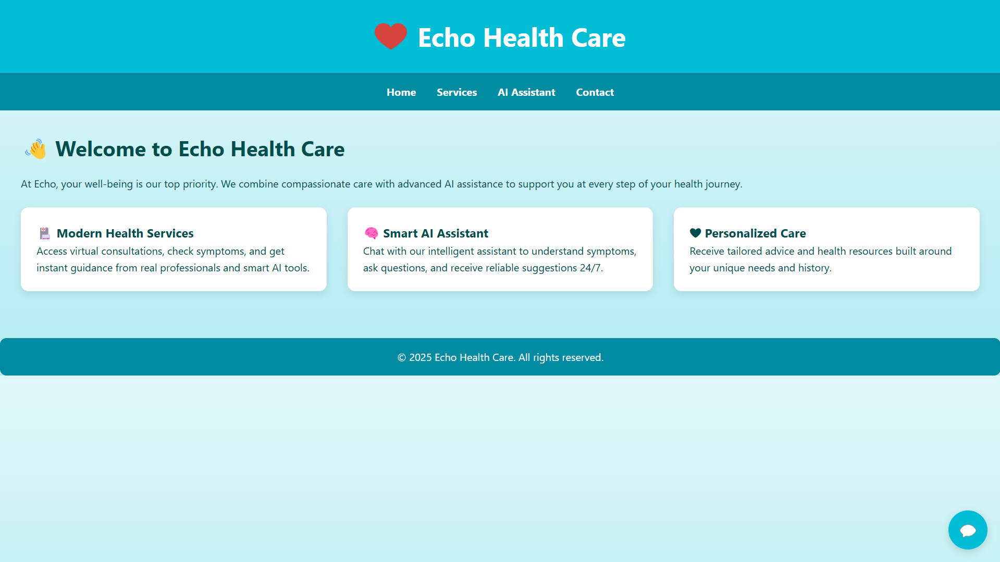
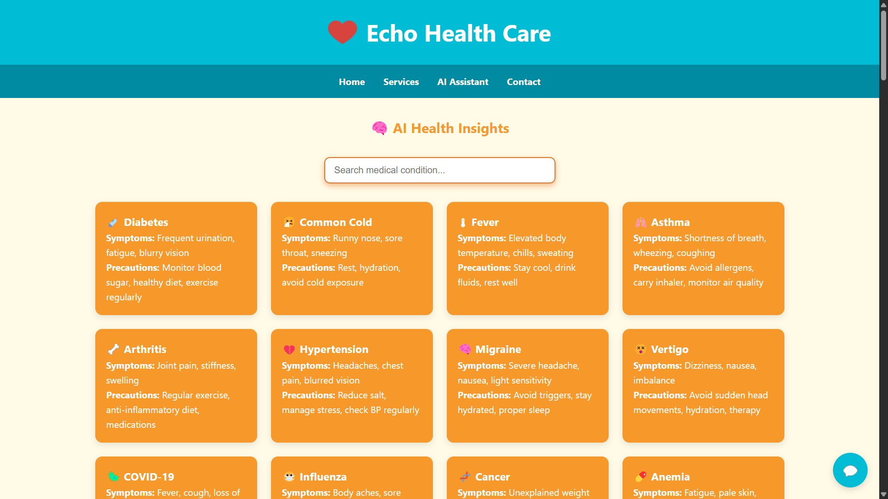
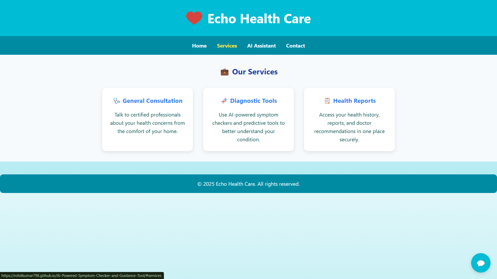
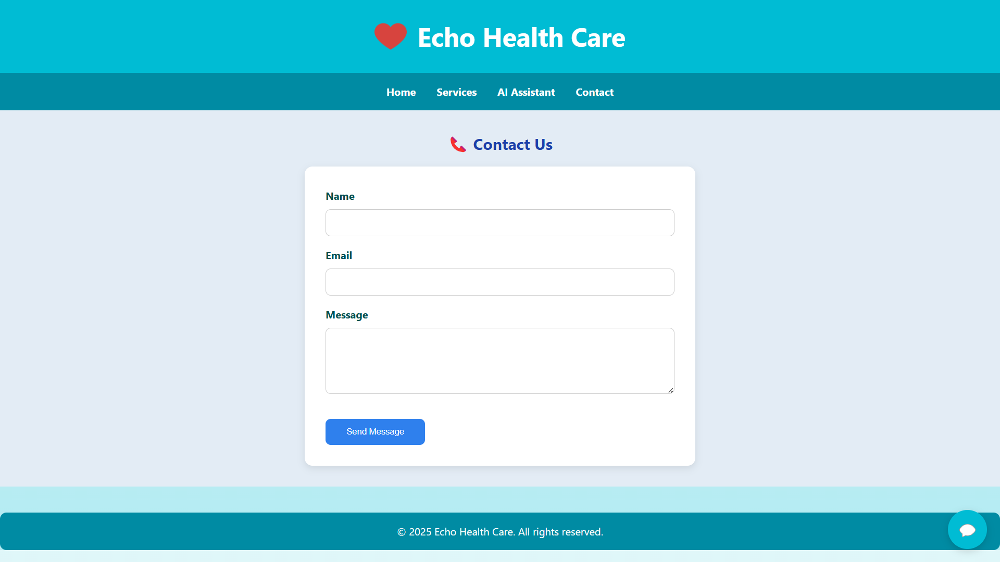

# Echo Health Care 🌐🩺

Welcome to **Echo Health Care**, a modern web-based health assistant that combines AI support with human compassion. This responsive web application provides an interactive platform for users to explore various health conditions, get basic insights, and access healthcare-related services — all powered by a smooth UI and smart search functionality.

---

## 🚀 Features

- 🧠 **AI Assistant Chatbot** – 24/7 basic health interaction and responses.
- 🏥 **Interactive Medical Cards** – Quick access to over 70+ conditions with symptoms and precautions.
- 💼 **Services Section** – Know what Echo Health Care can provide including consultations, reports, and tools.
- 🔍 **Live Search Functionality** – Real-time search to filter through medical conditions.
- 📱 **Responsive Design** – Looks and works great on all screen sizes.
- 🔐 **Login Overlay** – Secure entry using username/password (demo: `admin/admin`).
- 💬 **Scroll Reveal Animations** – Smooth appearance transitions as you browse.

---

## 📂 File Structure

- `index.html` – The main HTML file containing all styles, scripts, and content.
- [Optional Future Assets]
  - `style.css`, `script.js`, `assets/` – For further modularization (not included in current build).

---

## 🛠 How to Use

1. Open `index.html` in any modern web browser.
2. Use login credentials (`admin/admin`) to access the platform.
3. Navigate through sections: Home, Services, AI Assistant, and Contact.
4. Use the search bar in **AI Health Insights** to filter health topics.
5. Explore chatbot functionality in the bottom right corner.

---

## 🔐 Login Credentials

| Username | Password |
|----------|----------|
| admin    | admin    |

> These are demo credentials for testing purposes.

---

## 📸 Screenshots

### 🔐 Login Overlay

### 🏠 Home

### 🧠 AI Assistant + Cards

### 🏥 Services Section

### 🏥 Contact

> **Note**: Create a `screenshots/` folder and add screenshots with the names above.

---

## ✨ Technologies Used

- **HTML5 + CSS3** (with media queries)
- **Vanilla JavaScript**
- **Intersection Observer** (for scroll animations)
- **Responsive Web Design Techniques**

---

## 📧 Contact

If you’d like to contribute or have feedback, feel free to reach out through the contact form in the app or open a pull request.

---

© 2025 Echo Health Care. All rights reserved.
